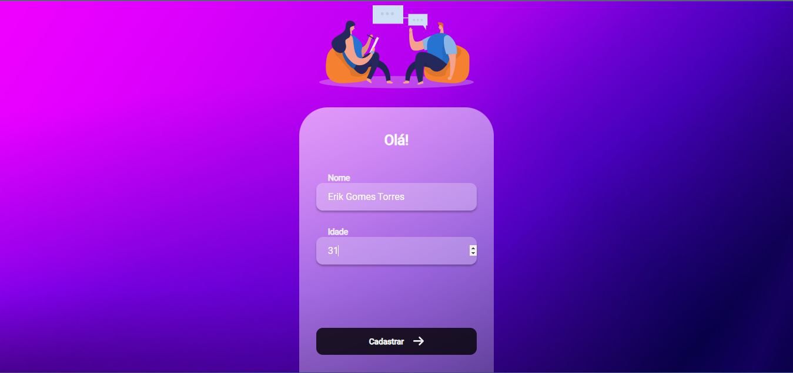
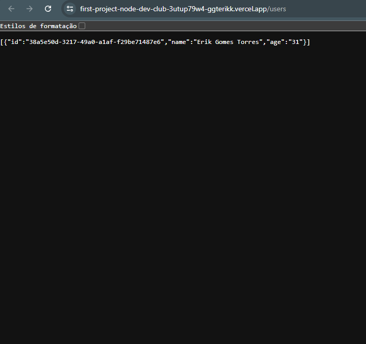

# Registro de Usuários

## Descrição:

    Neste projeto desenvolvido com React, foi criado um formulário de preenchimento com nome e idade
    do usuário para fazer o cadastro. Foi também inserida uma verificação para que só possam se cadastrar
    os usuários maiores de 18 anos.
    Foi também criada uma API com Node.js para ser consumida e atuar como o back-end para fazer a requisição
    de cadastro dos usuários.
    Os usuários cadastrados são armazenados no LocalStorage e também há o botão de deletar cada um da lista.
    Uma rota é a Home, para preencher os inputs com nome e idade, ao apertar o botão 'Cadastrar', redireciona
    para a rota de Users, onde podemos ver o nome e a idade de cada usuário.

 
 

> Imagens do projeto:

    
    
    

 

### Tecnologias utilizadas 💻:

 
 

### Criação:
> 'npx create-react-app'

### Rodar a aplicação:
> 'npm start' ou 'yarn start'

### Para clonar este repositório:
> git clone https://github.com/gGtEriKk/usersRegisterApp.git

### Link da API (Repositório):
<a href="https://github.com/gGtEriKk/firstProjectNodeDevClub/tree/master">Clique aqui</a>

### Deploy da API (rota 'users'):
<a href="https://first-project-node-dev-club-3utup79w4-ggterikk.vercel.app/users">Clique aqui</a>

### Desenvolvido por:

<table>
  <tr>
    <td align="center">
      <a href="https://github.com/gGtEriKk">
         
          
            <b>Erik Gomes</b>
          
      </a>
</table>
